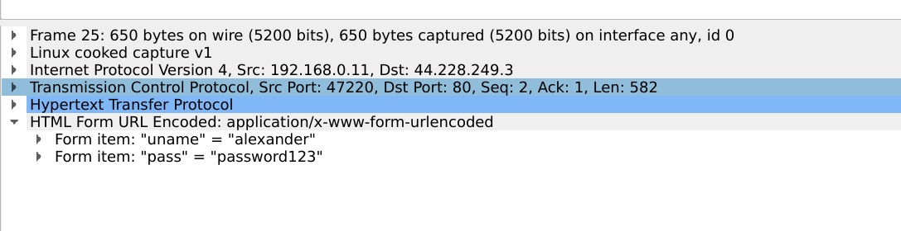
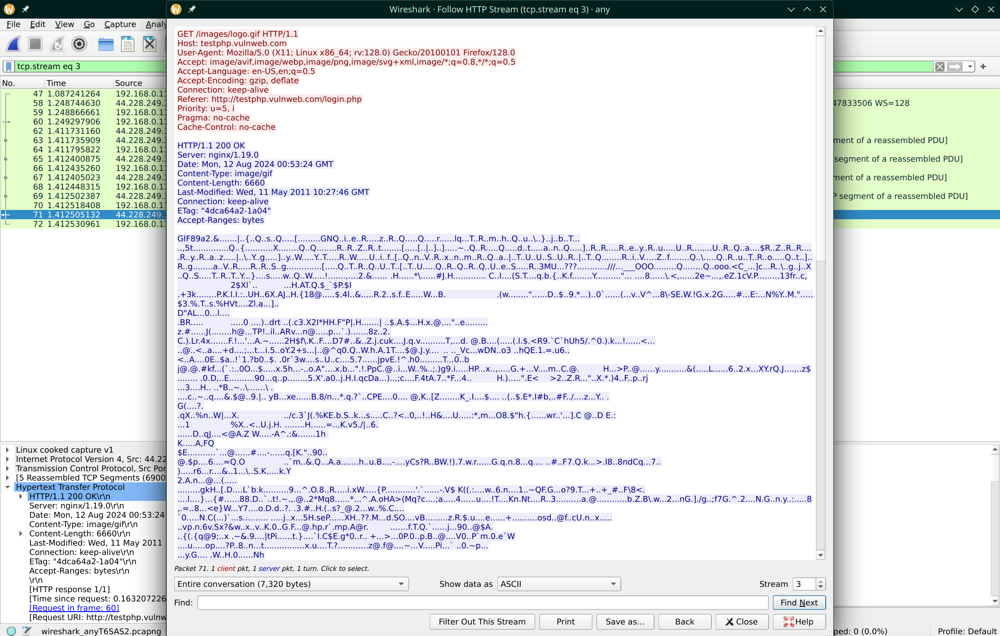
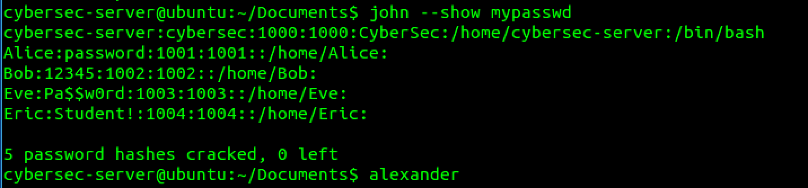
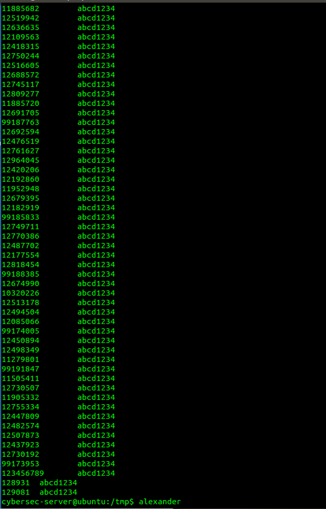

# CSEC Week 1 Part 1

## Task 1: Submit a screenshot of the username and password from Wireshark  

## Task 2:  Take a screenshot of the object of the image ‘logo.gif’ in the HTTP object list  

## Task 3: Using Zenmap and/or NetCraft to scan www.uts.edu.au. Gather and compare the information collected.  

1. What is its Ip address?  
   Scanned 60.254.143.40, but domain has the following other addresses: 60.254.143.10 2001:8002:e22:ef00::6866:f451 2001:8002:e22:ef00::6866:f443  
2. Type the IP address in the browser to access the webpage, explain your observations.  
   Invalid URL, the website is probably behind a reverse proxy.  
3. Who is the IP owner?  
   NetCraft found the ip 2.19.176.152, which is owned by Akamai Technologies.  
4. What is the server’s operating system?  
   Ubiquiti Dream Machine Pro gateway (Linux 4.19)  
5. What type of web server is being used?  
   AkamaiGHost (Akamai's HTTP Acceleration/Mirror service) - This server seems to be a relay of some kind to the actual UTS server.  
6. What is its server-side scripting technology?  
   According to NetCraft, they use Drupal PHP  
7. Can you find the email for the domain admin of this website for a possible phishing attack?  
   `dnsadmin@uts.edu.au`  
8. What is the ‘Reverse DNS’ for the website?  
   `a60-254-143-40.deploy.static.akamaitechnologies.com` - For the nmap scanned IP.  
9. Who is the domain registrar?  
   audns.net.au  
10. What is nameserver organization?  
    whois.audns.net.au
11. What company is hosting the website?  
    uts.edu.au  
12. Where is the hosting company geologically located?  
    AU  

# CSEC Week 2 Part 2

## Task 4: Use John the Ripper to crack password 4: Use John the Ripper to crack password 

1. Eric's password is Student!  
   
2. The longer a password it, the better. It should also not contain common words or phrases that may be found in wordlists.

## Task 5: SQL Injection

1. Sadly did not get a screenshot of this, but it was quite easy. Username should be set to `' or 1=1 #` and password to any non-empty string. The `#` makes the code skip the check for the password entirely, and it just returns the rows of all users. The username chech evaluates to true.  
2. You can also use the above injection in the password field. Then it will still do the username check, but the password check will evaluate to true. This is useful if you already know the username of the user you wish to log in as.  
3. I extracted the table to a file:  
     
4. Just take one of the username/password pairs in the above list and log in with them, also didn't get a screenshot of this part.  

