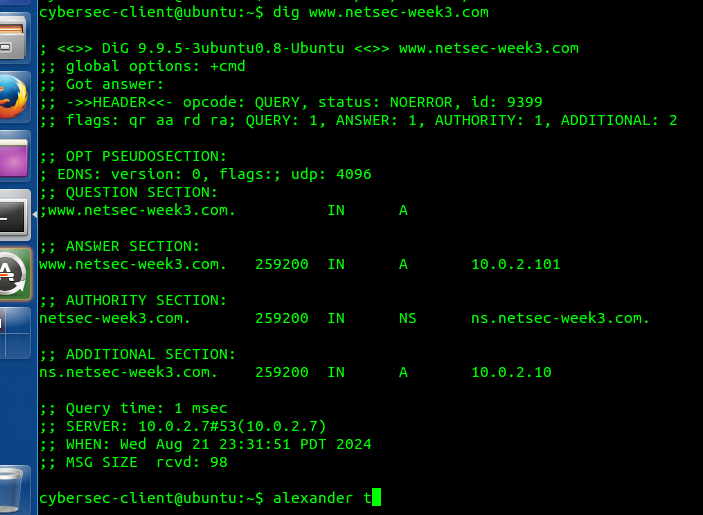

# CSEC Week 3 Lab 2 assesment

## Task 1: Editing the HOSTS file

- Dig command before nameserver change  
    
- Interfaces file after nameserver change  
    
- Dig command after maneserver change  
    

## Task 2: Attack by spoofing DNS response

- Dig command in the client  
    
- Wireshark DNS packet capture  
    
- Netwag configuration (forgot to include the TTL and spoof type in the screenshot)  
    
- Dig command after netwag attack (Not successful cause the real DNS server responds first)  
    
- Wireshark DNS packet capture during attack  
    
- Wireshark attack packet info section  
    

## Task 3: DNS Server Cache Poisoning

- Netwag configuration  
    
- Dig command with poisoned response  
    
