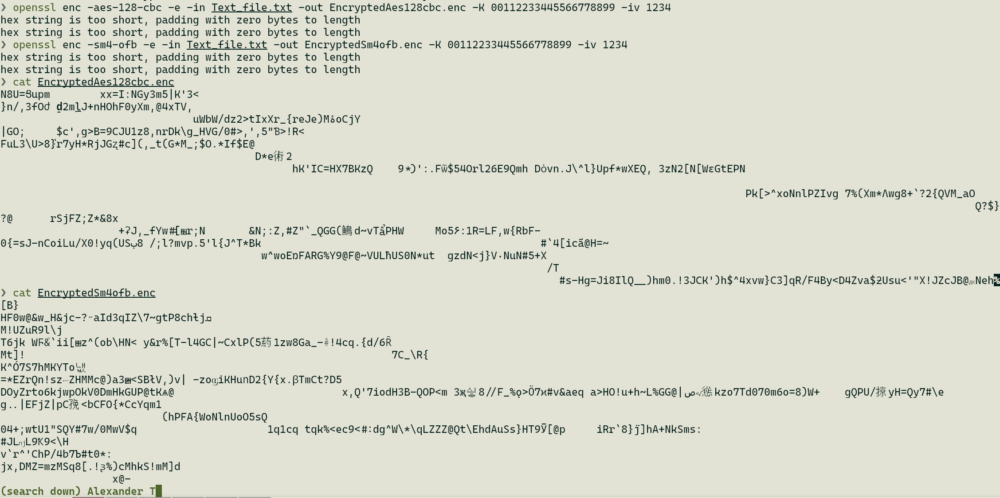
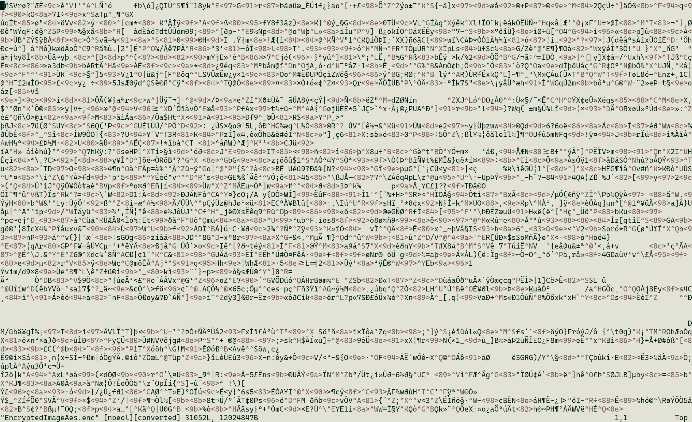
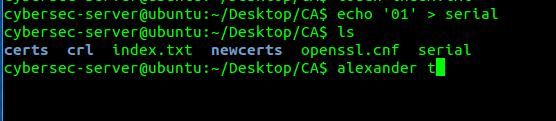
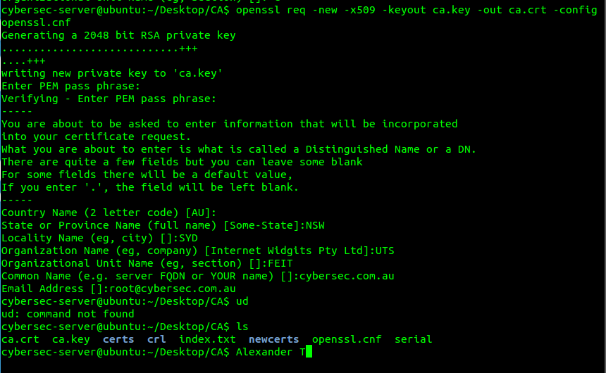
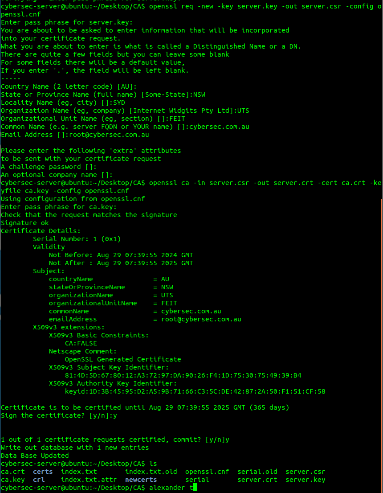
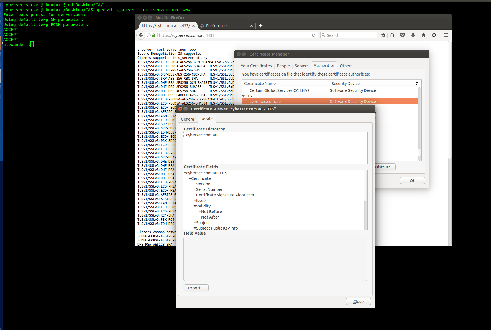

# CSEC Week 04 Lab 03

## Task 1 - Basic encryption and decryption using OpenSSL

1. The two outputs are both encrypted and both look different. The commands I used were:  
   `openssl enc -aes-128-cbc -e -in Text_file.txt -out EncryptedAes128cbc.enc -K 00112233445566778899 -iv 1234` and  
   `openssl enc -sm4-ofb -e -in Text_file.txt -out EncryptedSm4ofb.enc -K 00112233445566778899 -iv 1234`  
   Screenshot:  
     
2. Exact same as above  
   

## Task 2 - Become a Certificate Authority (CA)

1. 
2. 
3. 
4. 
