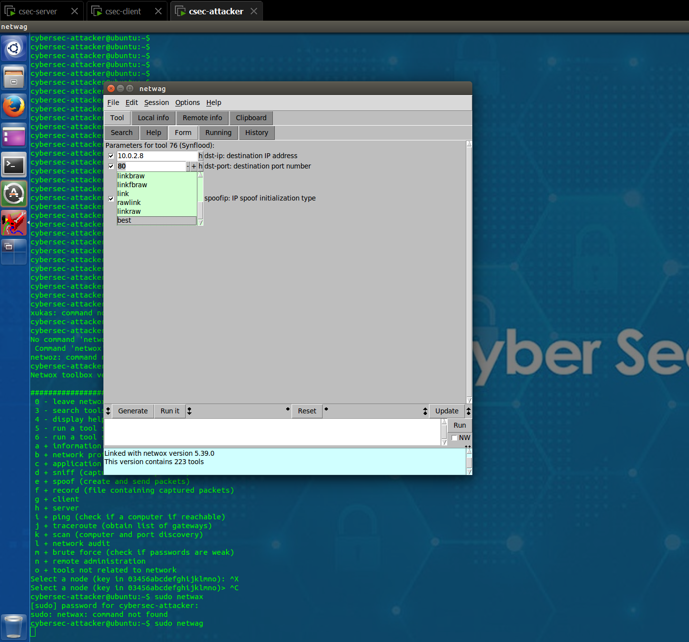
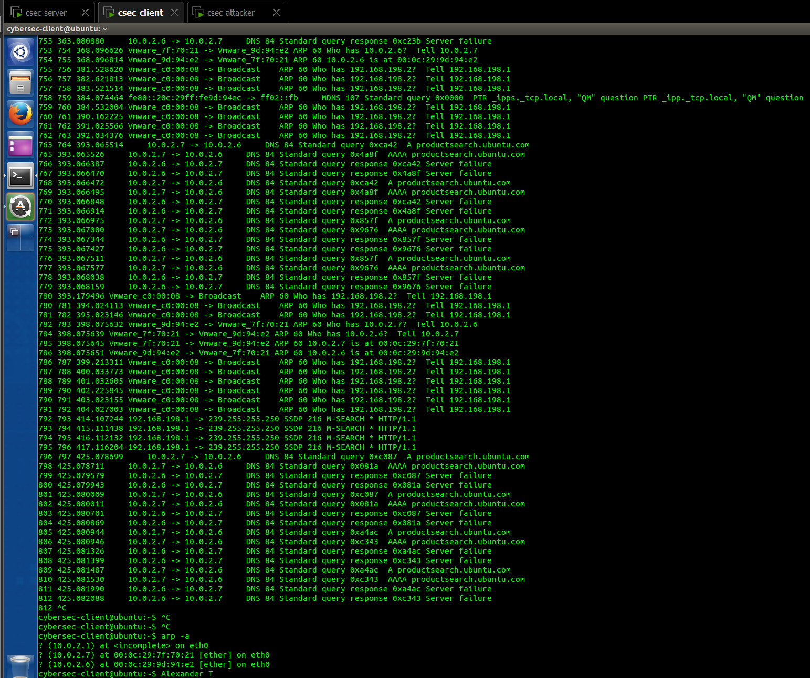
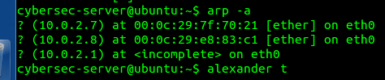
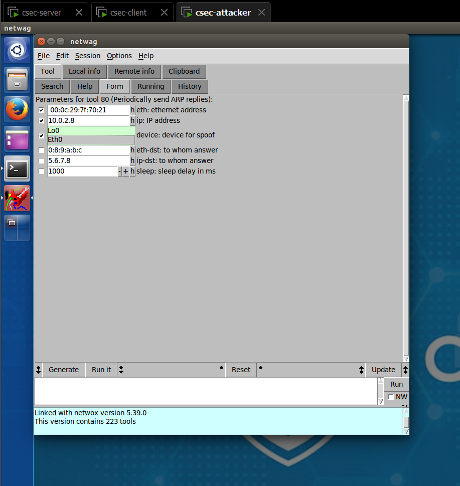
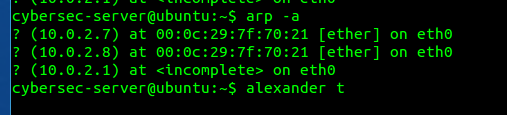
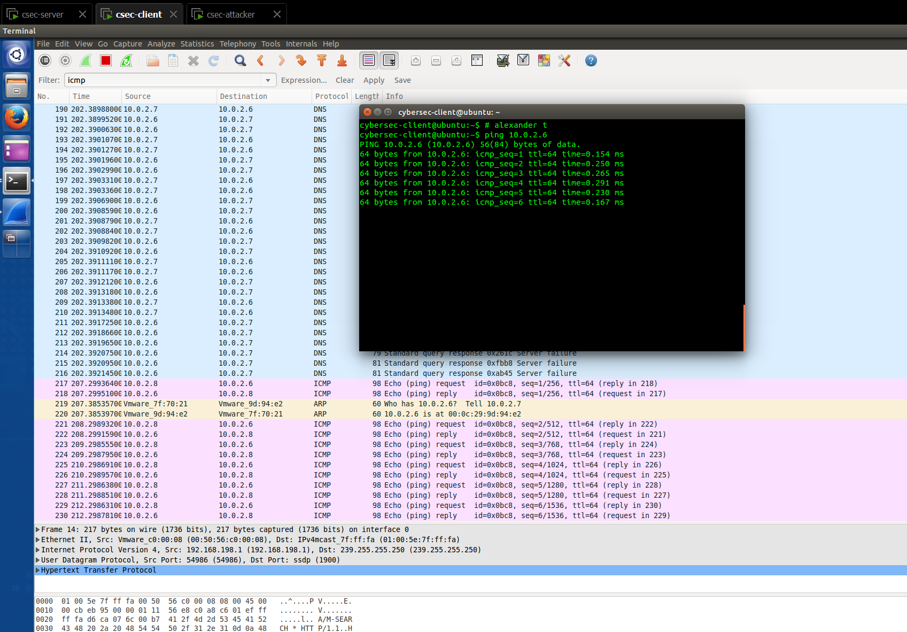
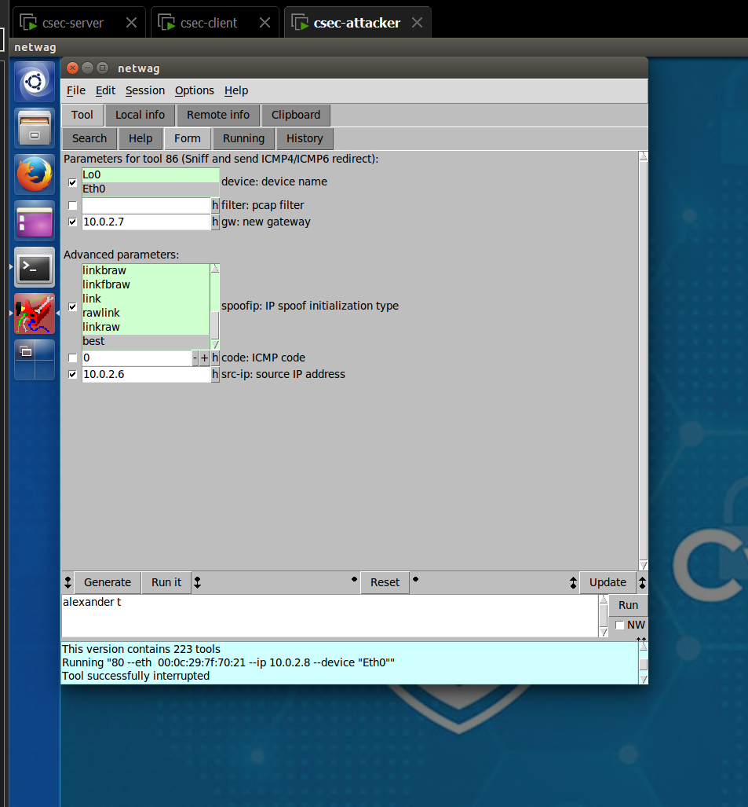
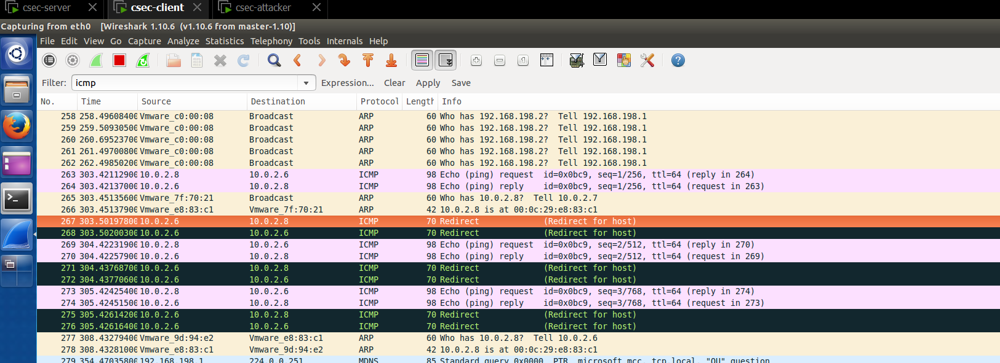

# CSEC Week 05 Lab 04

## Task 1 - SYN Flooding Attack

1.   
     

2. We can see from the screenshots that as soon as the SYN flooding attack is initiated from the attacker, the client gets flooded with ARP packets (there are also some DNS queries from the Ubuntu app store, but those are not part of the attack).
3. While a DOS attack attempts to overwhelm a server due to the sheer number of requests, this can be somewhat mitigated by simply improving the hardware. A SYN flood attack exploits the queue size of the target server, which means improving the hardware may not protect against SYN flood attacks - you also need to increase the queue size (or even better, use key hashes to prevent using the queue altogether for unfinished requests). This attack is easily mitigated now, but can be quite impactful to availability.

## Task 2 - ARP cache poisoning

1.   
     
     

2. We can see that after running the attack, the server's ARP cache points the Clients IP address to the Attackers MAC address, effectively spoofing the client.
3. To mitigate this attack we can:  
   1. Prevent the Attacker from entering the network - this is usually standard practice, but passwords on your networks!  
   2. Checking for duplicate MAC addresses - this can help detect an ARP spoofing attempt, but can be circumvented by the Attacker.  
   3. Static ARP table - impossible to scale and maintain.  
   4. Detecting and preventing with automated tools - probably best bet.

## Task 3 - ICMP Redirect Attack

1.   
     
     

2. After launching the attack, the client starts receiving redirects, prompting an updato to its routing.  
3. Biggest mitigation seems to just be not using ICMP at all.
