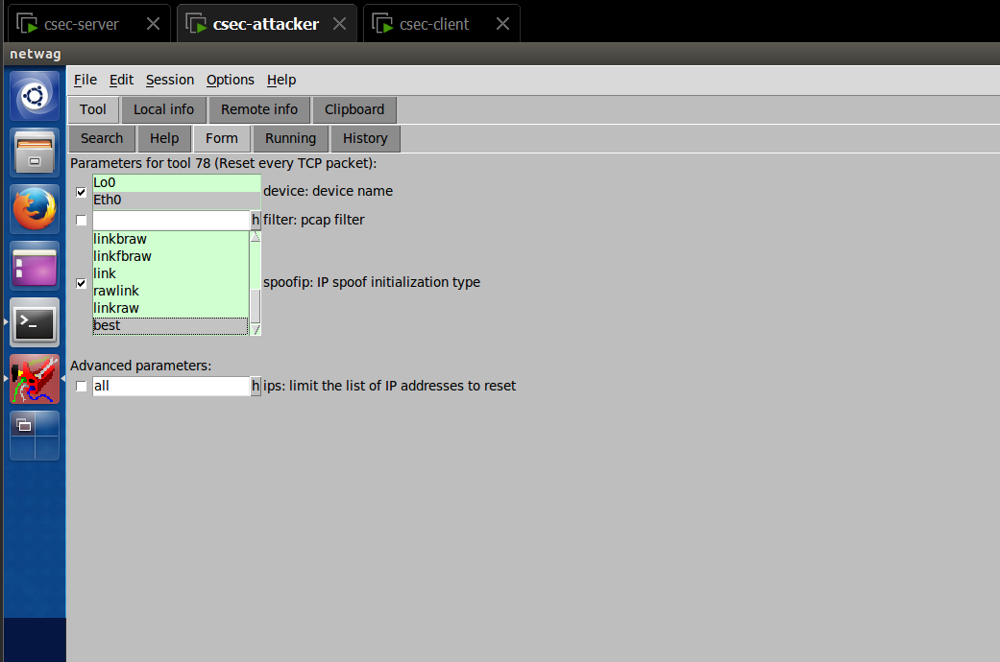

# CSEC Week 06 Lab

## Task 4 - TCP RST Attacks on Telnet and SSH Connections

## Task 5 - ICMP Blind Connection-Reset and Source-Quench Attacks

### (i) ICMP Blind Connection-Reset

### (ii) Source-Quench Attacks

## Task 6 - TCP Session Hijacking

