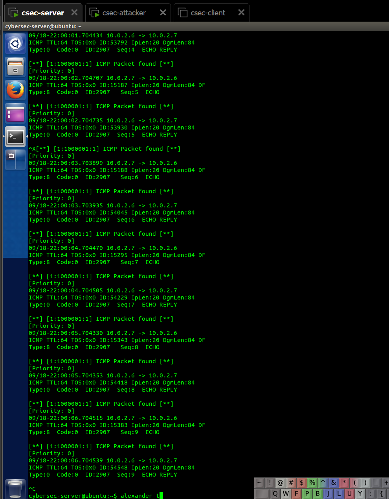
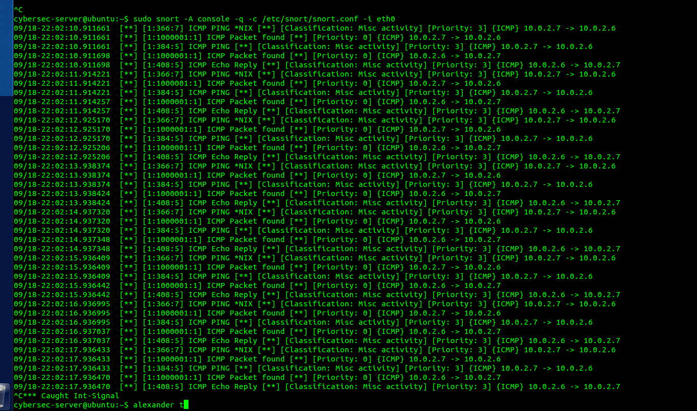
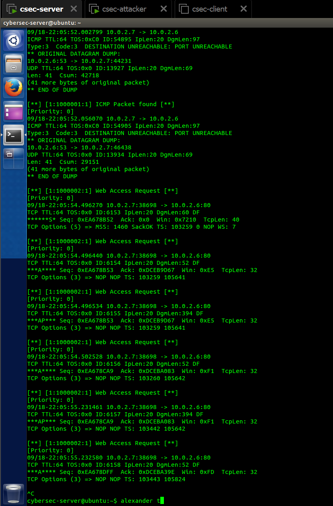
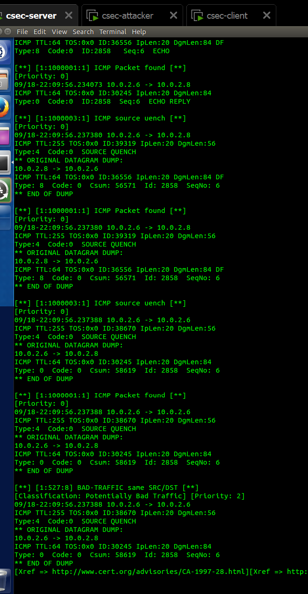
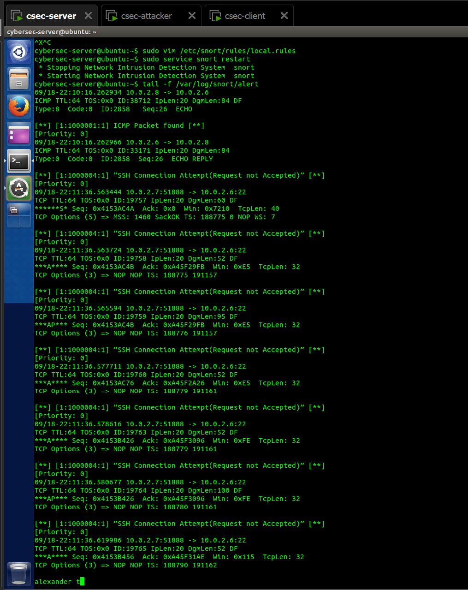

# CSEC Week 07 Lab

## Task 1 - Adding a Rule for ICMP Packets

## Task 2 - Snort in IDS mode and displaying alerts to the console.

## Task 3 - Generating alerts for web service

## Task 4 - Generating alerts for ICMP Source Quench Packets

## Task 5 - Running Snort as Intrusion Prevention System (IPS)

